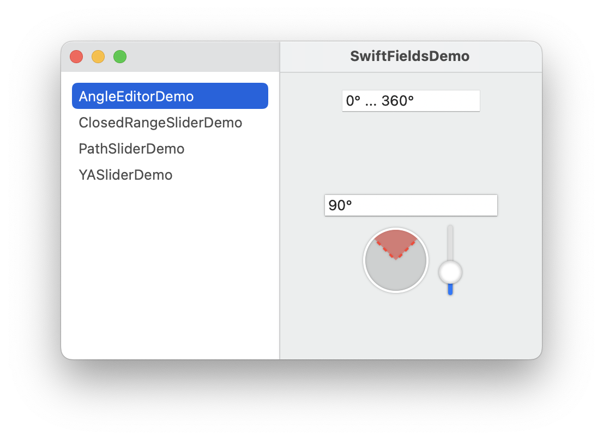
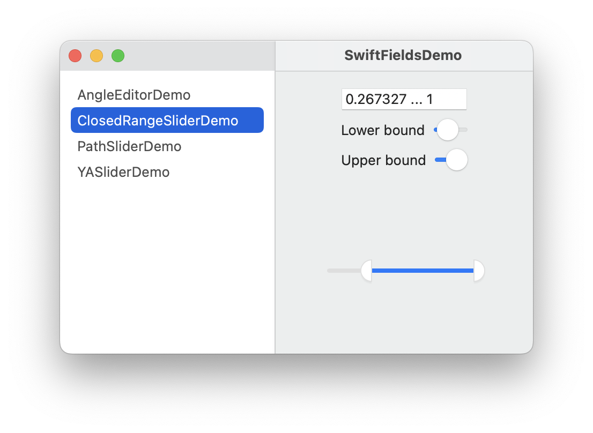
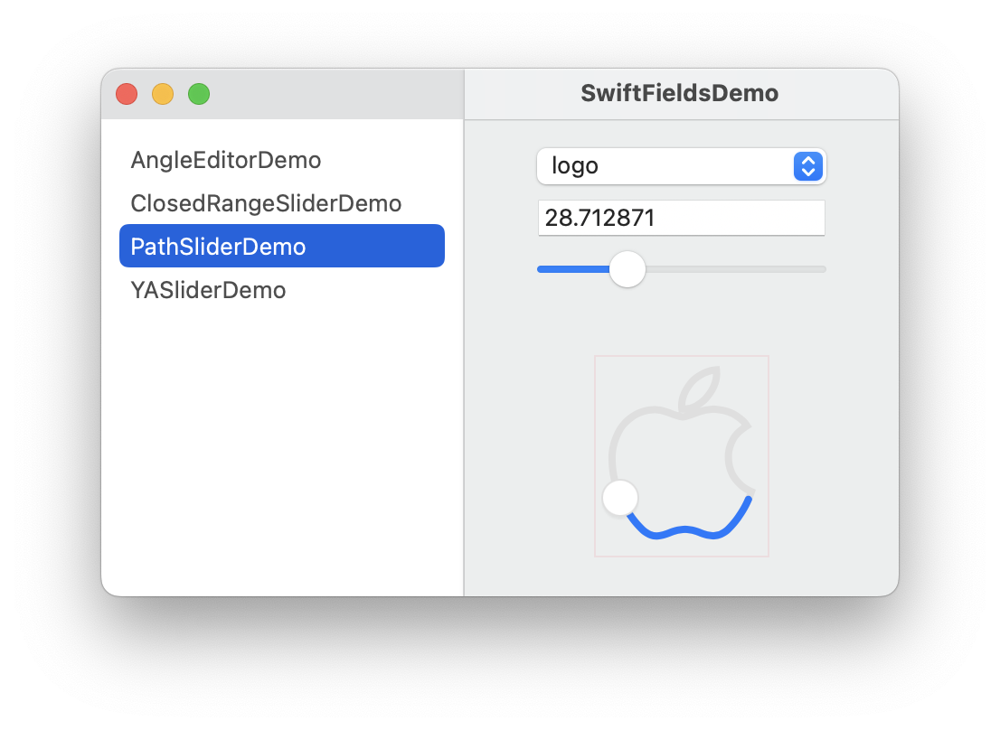
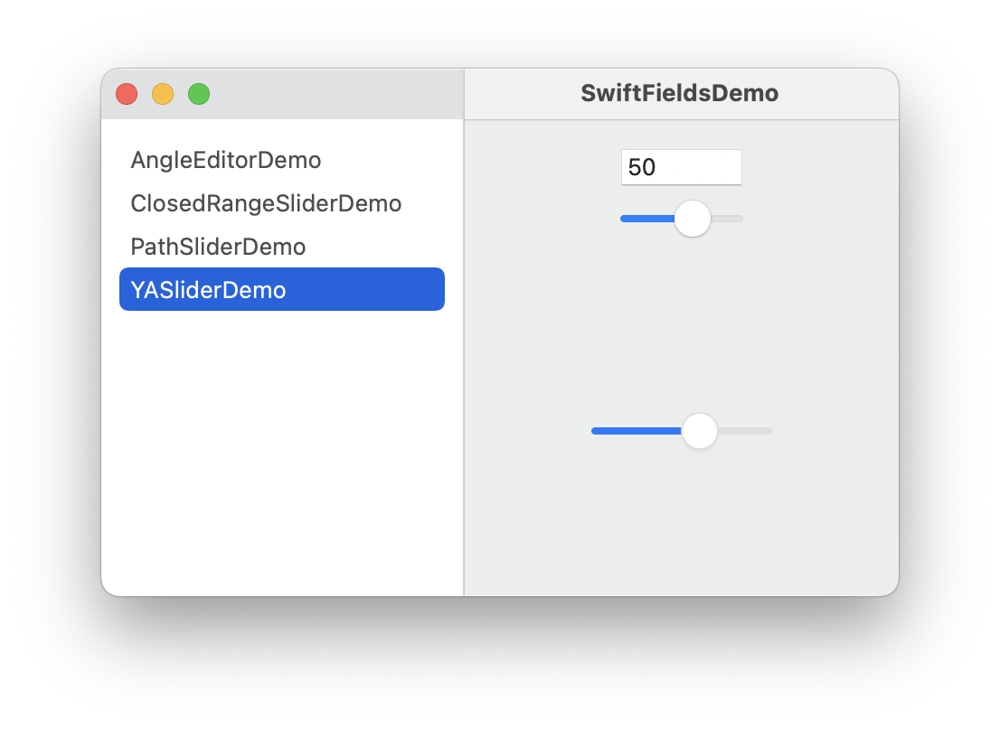

# SwiftFields

SwiftFields is a collection of SwiftUI widgets for editing data. It was originally created with the aim of providing widgets for editing values in a 3D editor such as angles, vectors, matrixes, quaternions, etc.

This library is in early development.

Current widgets:

- ``AngleEditor``: A widget for editing angles. 
- ``ClosedRangedSlider``: A slider for editing a ClosedRange of Doubles. 
- ``PathSlider``: Like SwiftUI's `Slider` but you can slide the thumb along any arbitrary path. 
- ``YASlider``: Like SwiftUI's `Slider` but with more functionality including vertical orientation, ~~custom thumb, and custom track~~. (Built on top of ``PathSlider``) 

## TODO

- [X]: Use vertical slider for AngleEditor
- [ ]: Finish angle editor range limits
- [X]: Accessibility for AngleEditor
- [ ]: Highlight thumb for PathSlider
- [ ]: Dark mode support for PathSlider
- [ ]: Get inner shadow/glow working for PathSlider
- [ ]: Accessibility for ClosedRangeSlider
- [ ]: Make YASlider (PathSlider?) support labels.
- [ ]: Angle editor in dark mode
- [ ]: iOS pass on all widgets
